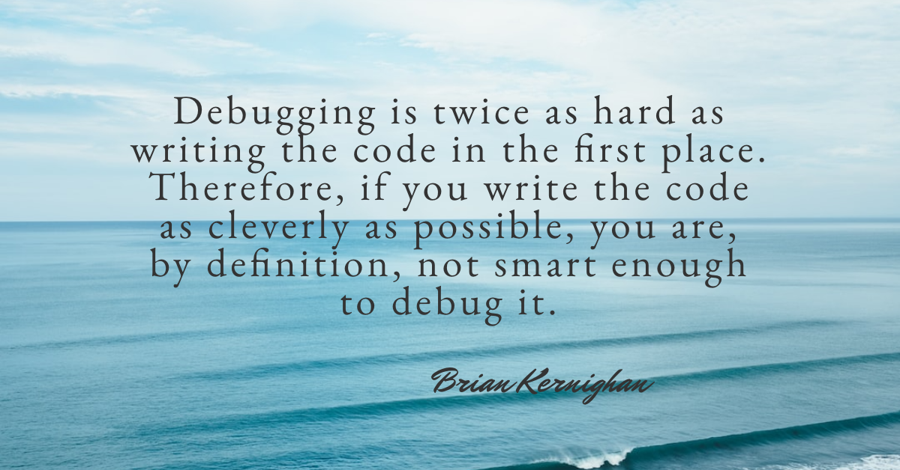
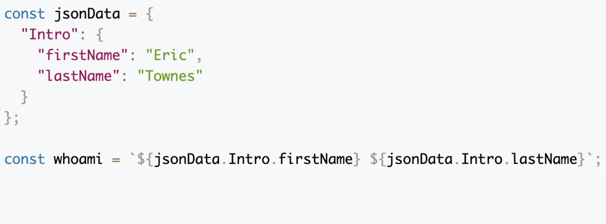
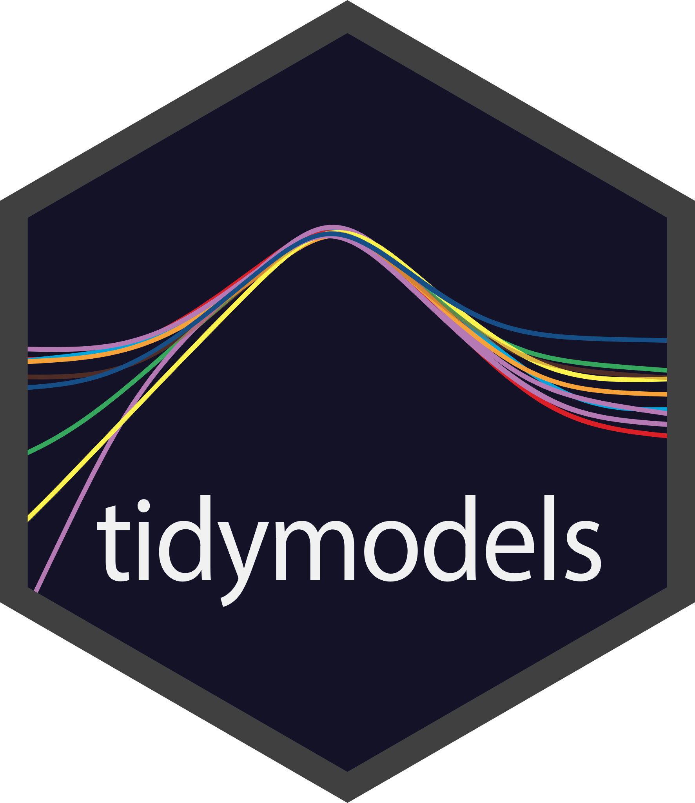
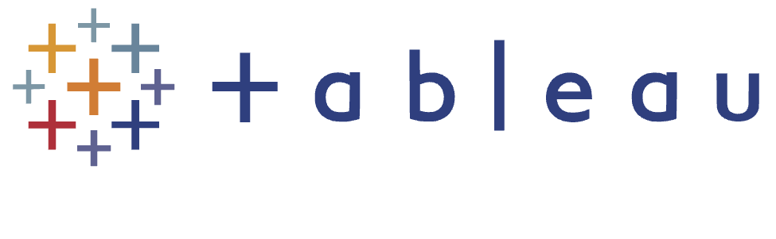

    

 

## Hey There! ✌🏽

 

<table>
    <tr>
        <td align="center">
            &nbsp;  &nbsp; 
             
            &nbsp;  &nbsp; 
              
            &nbsp;  &nbsp; 
             
        </td>
        <td>
            
        </td>
    </tr>
</table> 

## About Me 🧑🏽‍💻

🪖 &nbsp; Enrolled in Codeup's Java Full Stack Bootcamp until <em><strong>18 March 2024</strong></em> as a VET TEC beneficiary. 
📚 &nbsp; B.S. in Information Studies from <a href="https://www.usf.edu/" target="_blank">Uni of S. FL</a> / concentration in Data Science and Analytics using R . 
🚴🏽‍ &nbsp; Really enjoy cycling - raced a couple of sanctioned events with 1 top 10 finish! 
🗺️ &nbsp; Bilingual in English and Dutch - do need to brush up on conversational Spanish. 
💧 &nbsp; Slowly learning Agile/Scrum, developing on Google Cloud, and Tensorflow.js. 
 

## Tools 🛠️ &nbsp; | &nbsp; (...skilled by 18 March '24)

* #### Learning / Using:

<table>
  <tr>
    <td></td>
    <td></td>
    <td></td>
    <td></td>
    <td></td>
    <td></td>
    <td></td>
  </tr>
</table>

* #### Used: 😢

<table>
  <tr>
    <td></td>
    <td></td>
    <td></td>
    <td></td>
    <td></td>
    <td></td>
  </tr>
</table>

 

* 

    
Minimalist 🌐 🔗 links
 

  * <a href="https://developer.mozilla.org/en-US/docs/Web/JavaScript" target="_blank">MDN Web Documentation</a>.
  * <a href="https://docs.oracle.com/en/java/javase/17/index.html" target="_blank">Java SE 17 Documentation</a>.
  * <a href="https://docs.spring.io/spring-boot/docs/current/reference/html/index.html" target="_blank">Spring Boot Reference Documentation</a>.
  * <a href="https://www.statlearning.com/" target="_blank">An Introduction to Statistical Learning</a>.

 

## Notes 📓

🗒️ &nbsp; <a href="notes.md" target="_blank">Hodge podge of tech snippets</a>  

##  Portfolio 📚

📑 &nbsp; <a href="https://eltownes.github.io/eltownes/codeup-projects.html" target="_blank">The current Codeup projects page.</a> 

📑 &nbsp; Surly 😡 Data: a little bit of statistical counseling for bad-tempered data i.e. machine learning.
* Mostly captures USF's final course: <em>Predictive Analytics</em> along with some quasi capstone stuff.
   * R and its tidy paradigm.
      * Predict credit worthiness for new applications at Small Bank USA.
         * <a href="https://www.youtube.com/watch?v=bW47QDyInDo" target="_blank">Business summary on YT</a> and
             the <a href="https://github.com/surlydata/Surly-Data/blob/main/Credit%20Worthiness/Credit%20Worthiness.pptx" target="_blank"> PowerPoint on GitHub</a> (hint: 'view raw').
         * <a href="https://www.youtube.com/watch?v=-j7Wko_C374" target="_blank">Code review on YT</a> and
             the <a href="https://github.com/surlydata/Surly-Data/tree/main/Credit%20Worthiness" target="_blank"> GitHub directory</a>.
   * <a href="https://www.alteryx.com/" target="_blank">Alteryx's</a> no-code/low-code analytics platform.
     * Predict diabetes using the Pima Indians Diabetes Dataset.
         * <a href="https://www.youtube.com/watch?v=T2I1sy6X38s&t=4s" target="_blank">GUI-based ML workflow on YT</a> and
             the <a href="https://github.com/surlydata/Surly-Data/tree/main/Pima%20Indians%20Diabetes" target="_blank"> GitHub directory</a>.
         * <a href="https://www.youtube.com/watch?v=HIquVB1o3DM" target="_blank">Deeper dive of the Confusion Matrix on YT</a> and
             the <a href="https://github.com/surlydata/Surly-Data/tree/main/Confusion%20Matrix" target="_blank"> GitHub directory</a>.       

📑 &nbsp; An experimental R Package (<a href="https://github.com/eltownes/CryptoR/blob/main/CryptoR_Vignette.pdf" target="_blank">pdf vignette on GitHub</a>)
    that explores a core feature of the CoinGecko cryptocurrency API. 

📑 &nbsp; A <a href="https://public.tableau.com/app/profile/eric.townes/viz/WorldReligions_15880970461920/Panorama" target="_blank">Tableau interactive dashboard</a> published on Tableau Public that explores 
   world religions. FYA, a warning pops up because the dashboard links to a YT video. The <a href="https://github.com/eltownes/USF-LIS4317/tree/master/Final%20Project" target="_blank"> GitHub README</a>. 

📑 &nbsp; Micro blog posts covering some of USF's analytics courses.
* <a href="https://et-lis4761.blogspot.com" target="_blank">Data & Text Mining</a> and the <a href="https://github.com/eltownes/USF-LIS4761" target="_blank"> GitHub README</a>.
* <a href="https://et-lis4317.blogspot.com" target="_blank">Visual Analytics</a> and the <a href="https://github.com/eltownes/USF-LIS4317" target="_blank"> GitHub README</a>.
* <a href="https://et-lis4273.blogspot.com" target="_blank">Statistics and Analytics</a> and the <a href="https://github.com/eltownes/USF-LIS4273" target="_blank"> GitHub README</a>.
* <a href="https://et-lis4370.blogspot.com" target="_blank">R Programming</a> and the <a href="https://github.com/eltownes/USF-LIS4370" target="_blank"> GitHub README</a>.
  

## Stats 🧮

<table>
    <tr>
        <td style=" text-align: center; vertical-align: top;">
            
        </td>
    </tr>
    <tr>
        <td style="text-align: center; vertical-align: top;">
                        
        </td>
    </tr>
</table>
